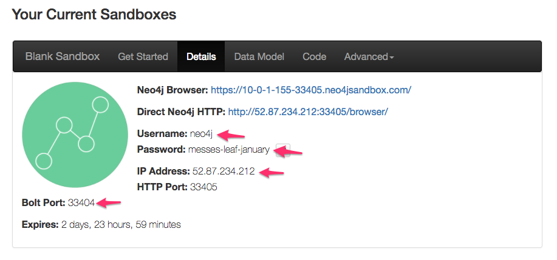
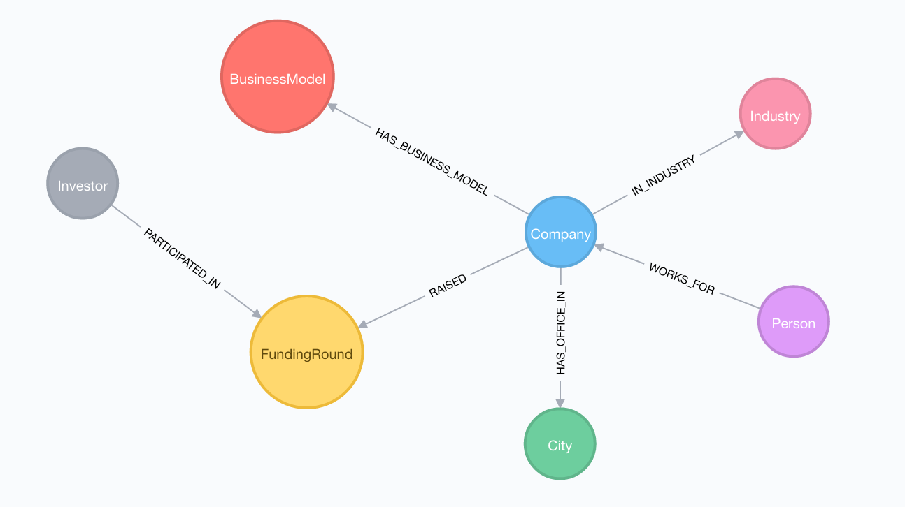

# mattermark-graphql-neo4j

Query the Mattermark GraphQL API using Apollo-Client, saving data into Neo4j.

## Instructions

### Mattermark API Key

You'll need a Mattermark API key. If you don't have one, you can create a trial account [here](http://mattermark.com)

### Neo4j

To import data from the Mattermark API into Neo4j you'll need a Neo4j instance. You can use a local install, or quickly spin up a blank Neo4j Sandbox instance [here](https://neo4j.com/sandbox-v2).


*Note the credentials, needed for the next step*

### Environment variables

Export your api token and neo4j credentials as environmet variables:

```
export MATTERMARK_TOKEN=YOUR_API_TOKEN_HERE
export NEO4J_URI=bolt://HOST_IP_HERE:BOLT_PORT_HERE
export NEO4J_USER=NEO4J_USERNAME_HERE
export NEO4J_PASSWORD=NEO4J_PASSWORD_HERE
```

### Run

1. `npm install`
1. `node index.js`

## Data

By default the script will query for all companies with an office in Montana where the company's last funding round was greater than zero, then run an additional query for each company meeting that criteria to find funding rounds, business models, industries and personnel.


*The Neo4j property graph model, once the data is imported from Mattermark*

## Neo4j Queries

TODO

See the blog post for more examples.

## TODO

- [ ] handle pagination
- [ ] handle rate limits